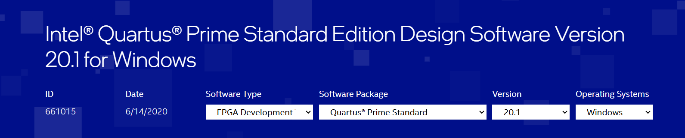
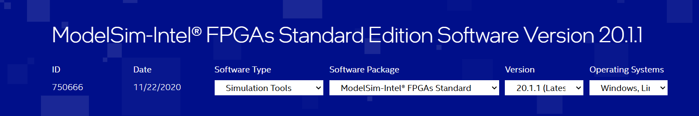

# Software Versions

## Quartus Prime

- **Version:** 20.1

Quartus Prime is a software tool provided by Intel FPGA for designing and programming FPGA devices. Version 20.1 was used for the development of the Verilog RTL code for the UART transceiver implemented on the DE0-Nano FPGA board.

**Download from [here](https://www.intel.com/content/www/us/en/software-kit/661015/intel-quartus-prime-standard-edition-design-software-version-20-1-for-windows.html)**

## ModelSim Intel FPGA Starter Edition

- **Version:** 2020.1

ModelSim is a hardware simulation tool used for simulating HDL (Hardware Description Language) designs. The Intel FPGA Starter Edition of ModelSim, version 2020.1, was utilized for simulating the Verilog RTL code and validating the functionality of the UART transceiver design.

**Download from [here](https://www.intel.com/content/www/us/en/software-kit/750666/modelsim-intel-fpgas-standard-edition-software-version-20-1-1.html)**
